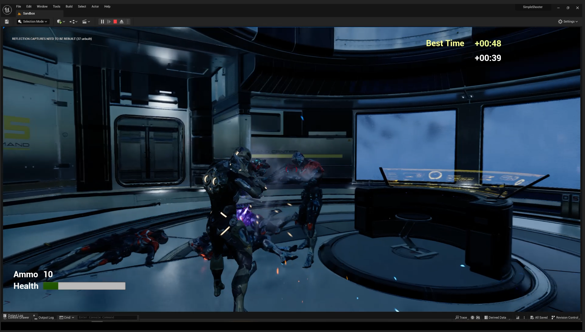

# SimpleShooter

Simple shooter developed using Unreal Engine 5 as part of the course [Unreal 5.0 C++ Developer: Learn C++ and Make Video Games](https://www.gamedev.tv/p/unreal-5-0-c-developer-learn-c-and-make-video-games/?coupon_code=DEVSTART) from [GameDev.tv](https://www.gamedev.tv)

## Improvements
The course goal for this module is to create a simple shooter with a single weapon and an end game condition based on defeating all enemies. A number of improvements were added to the game using the concepts learned through the present or previous courses.

### Secondary Weapon
A shotgun was added as a secondary weapon. The weapons can be switched by:

1. Using the mouse scroll wheel
2. Pressing 1 for the primary (Rifle) and 2 for the secondary (Shotgun)
3. Pressing triangle for PS type controller or Y for X-Box type controller

### Support Kits
The concept of support kits was implemented in the game. They all share the same behavior logic but the effect changes depending on the implementation

#### Shield Kit
Creates a bubble around the player that absorbs incoming damage and dissapears as soon as it's depleted

#### Ammo Kit
Resets the ammo count for both weapons

#### Aid Kit
Recovers a fixed amount of health points. This value can be configured both by code or blueprints

### High Score
The game records the time it took the player to complete the level and sets a *Best Time* in case the current time is lower that the last stored

